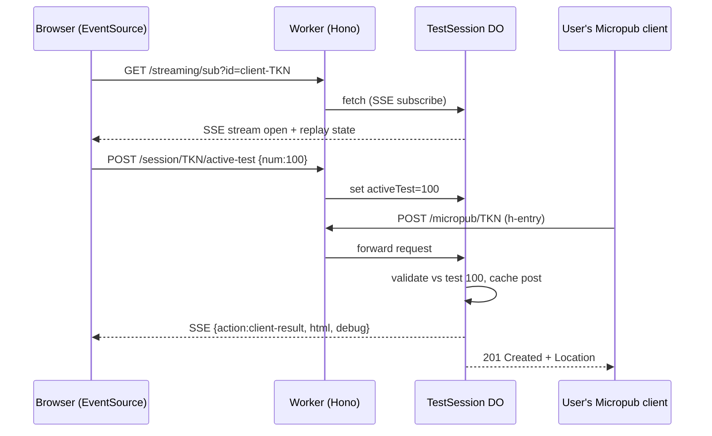

# micropub-litmus — build spec

A Cloudflare-native Micropub conformance tester. v1 ports the **client-test half** of `micropub.rocks` (aaronpk) to Workers + Durable Objects. The name is deliberately its own — this is not a drop-in replacement for the canonical micropub.rocks and shouldn't read as one.

**Repo/project name:** `micropub-litmus` (short form `mp-litmus` if a shorter package name or subdomain is wanted).
**Audience:** Claude Code, implementing from scratch in a fresh repo.
**Source of truth for behavior:** `aaronpk/micropub.rocks`, specifically `app/ClientTests.php`, `lib/Rocks/Redis.php`, and `views/client-tests/*`. Port _behavior_, not PHP structure. Throughout: "the original" / `micropub.rocks` = the PHP source being ported; **micropub-litmus** = the thing being built.

---

## 0. Decisions locked for this spec (flip any in one line and regenerate the affected section)

| Decision          | Choice                                                                 | Why                                                                                                                                    | Cost to flip                                                                          |
| ----------------- | ---------------------------------------------------------------------- | -------------------------------------------------------------------------------------------------------------------------------------- | ------------------------------------------------------------------------------------- |
| Which half        | **Client-test only**                                                   | Self-contained; the DO is load-bearing here; a visitor points any existing Micropub client at the endpoint with no server of their own | Server-test reuses the same DO+SSE core; it's a new test-runner module, not a rewrite |
| Browser transport | **SSE**                                                                | Original uses `EventSource`; keeping it means the ported views need zero transport changes                                             | WS hibernation is a drop-in swap of the DO's stream handling                          |
| Auth              | **Anonymous session token + stub IndieAuth endpoints**                 | No login needed to test; but real clients run discovery→authorize→token first, so we auto-approve those                                | Real IndieAuth is additive, gated behind the same token issuance                      |
| Persistence       | **Ephemeral only (DO storage + R2 for media)**                         | No public reports in v1                                                                                                                | Add D1+Drizzle later if reports return                                                |
| Stack             | **TypeScript · Hono · Workers · Durable Objects · R2 · Alchemy (IaC)** | Matches existing portfolio patterns (per-entity DO isolation)                                                                          | —                                                                                     |

**Explicitly out of scope for v1:** IndieAuth login/identity, the public implementation-report directory, D1, the server-test half, long-term media persistence.

---

## Working conventions

Maintain `implementation-notes.md` at the repo root throughout the build. It is an append-only log, not documentation — terse entries, newest at the bottom of each section.

**On any deviation from this spec:** pick the more conservative option, log it, and continue. Do not stop to ask unless the deviation invalidates a locked scope decision (v1 = client-test half only, no D1, no reports, stub IndieAuth).

Structure:

```markdown
# Implementation Notes

## Deviations

<!-- Spec said X, did Y instead. Format: [spec section] — what changed — why -->

## Spec gaps

<!-- Spec was silent, made a call. Format: [area] — decision — rationale -->

## Discovered unknowns

<!-- Things that surfaced mid-build worth knowing before v2: platform quirks
     (DO storage semantics, SSE-over-Workers edge cases, Alchemy behavior),
     surprising costs, things that were harder/easier than the spec assumed -->
```

Entry examples:

```markdown
## Deviations

- [§4 SSE transport] — used WebSocket hibernation API fallback for reconnect
  instead of Last-Event-ID replay — DO alarm + storage replay added complexity
  disproportionate to v1; logged for v2 revisit.

## Spec gaps

- [media uploads] — capped R2 object size at 10MB — spec silent; Micropub
  media endpoint tests don't exceed ~2MB.
```

**At each milestone (build order §12):** re-read the Deviations section before starting the next slice. If a deviation contradicts a later part of the spec, resolve it then, not at the end.

---

## 1. The one-sentence architectural thesis

> The original needs an external SSE streaming daemon **and** a Redis cache to make one Micropub test session work. Both collapse into a single Durable Object addressed by session token: the DO _is_ the per-session Micropub server, the ephemeral post store, and the SSE fan-out hub.

That consolidation is the whole point of the port. Keep it visible in the code.

---

## 2. What the original actually does (so the port stays faithful)

1. User starts a client test → gets a **token**, a **Micropub endpoint URL** containing that token, and a page with a live result panel.
2. The browser opens `EventSource('/streaming/sub?id=client-<token>')`.
3. User configures their Micropub client with the endpoint + token and hits "post".
4. The client's request lands on the server. The server validates it **against whichever test the browser is currently viewing** (`last_viewed_test`), renders a result HTML fragment + a debug dump, and publishes `{action:'client-result', html, debug}` on `client-<token>`.
5. The browser receives the SSE event and injects the fragment. Pass/fail shows live.

Redis in the original is **not** the message bus — it's a TTL cache (`setex`) of received post HTML/raw/properties, keyed `…:<token>:<num>:<key>:…`. The bus is the separate streaming server hit over HTTP.

---

## 3. Component map

```
Worker (Hono)  ── stateless router ──►  TestSession DO  (one per token)
   │                                         ├─ is the Micropub server for this token
   │                                         ├─ holds activeTest + per-test results
   │                                         ├─ caches received posts (ephemeral)
   │                                         └─ owns SSE connections + fan-out
   └─ R2 (media bytes only)
```

Rule: the Worker never validates Micropub payloads or holds session state. It resolves the token → DO stub → forwards. All per-session logic lives in the DO. (Same per-entity isolation pattern as per-user DO work — here the entity is a test session.)

### Live-test sequence



---

## 4. Durable Object: `TestSession`

One instance per token: `env.TEST_SESSION.idFromName('client-' + token)`.

### Responsibilities

- Be the Micropub server for its token (create + query + media).
- Track `activeTest` (which validator inbound posts are checked against).
- Store per-test results and the most recent received post (ephemeral, TTL via `alarm()`).
- Maintain the set of open SSE streams; fan out events; replay state on (re)connect.

### Storage schema (`ctx.storage` KV API)

```
meta                      → { token, createdAt }
activeTest                → number | null
result:<num>              → { passed: boolean, receivedAt: number, errors: string[] }
post:<num>                → { raw: string, format: 'form'|'json'|'multipart',
                             properties: object, html: string, receivedAt: number }
```

- 128 KiB per-value cap ⇒ **image bytes never go in DO storage; media goes to R2** (§7).
- `alarm()` sweeps entries older than the TTL (default 24h; original used 7d — shorter is fine for a session tool).
- Optional: back this with the DO **SQLite** storage backend if you later want queryable history. KV is enough for v1.

### Fetch interface (internal routes the Worker forwards to)

```ts
// Micropub surface (the actual test target)
POST /mp            // create — validate vs activeTest, cache, publish, return 201+Location or error
GET  /mp?q=config   // config query   → { "media-endpoint": "<url>", "syndicate-to": [...] }
GET  /mp?q=source   // source query   → previously-created post in mf2 json
GET  /mp?q=syndicate-to
POST /media         // multipart upload → store to R2, return 201 + Location

// Session control (called by the app UI, same-origin)
POST /active-test   // { num } → set activeTest
GET  /sub           // SSE subscribe (returns streaming Response)

// Auth shims (client compatibility, §6)
GET  /authorize     // auto-approve, redirect back with code
POST /token         // exchange code → the pre-issued token
```

### SSE handling (the piece replacing the streaming daemon)

```ts
// on GET /sub
const { readable, writable } = new TransformStream();
const writer = writable.getWriter();
this.sseWriters.add(writer); // retain across requests on the instance
await this.replayState(writer); // send current results so a reload rehydrates
// Support Last-Event-ID: on reconnect, replay only events after that id
return new Response(readable, {
   headers: {
      "content-type": "text/event-stream",
      "cache-control": "no-cache",
   },
});

// publish(event) → write `id: <n>\nevent: message\ndata: ${JSON.stringify(event)}\n\n`
//                  to every writer; drop writers that throw.
```

**Honest tradeoff to note in code comments:** SSE keeps the DO awake while a tab is connected (no WebSocket-Hibernation equivalent for SSE). Fine at this tool's volume; swap to WS + hibernation if that ever changes. This is the deliberate v1 call, not an oversight.

---

## 5. Worker routes (Hono)

| Route                                    | Purpose                                   | Action                                                     |
| ---------------------------------------- | ----------------------------------------- | ---------------------------------------------------------- |
| `GET /`                                  | Landing / start a session                 | Mint token, create DO, render session page                 |
| `GET /client/:token`                     | Test list + live panel                    | Server-render; browser opens EventSource                   |
| `POST /client/:token/active-test`        | User selected a test                      | Forward `POST /active-test` to DO                          |
| `GET /streaming/sub?id=client-:token`    | SSE                                       | Forward `GET /sub` to DO, stream Response straight through |
| `ALL /micropub/:token`                   | **The Micropub endpoint** clients post to | Forward to DO `/mp`                                        |
| `POST /media/:token`                     | Media endpoint                            | Forward to DO `/media`                                     |
| `GET /:token/auth`, `POST /:token/token` | IndieAuth shims                           | Forward to DO                                              |

Token resolution is the only routing logic. Everything stateful is a `stub.fetch()` away.

---

## 6. Auth shims (why they exist)

A conformant Micropub client discovers `authorization_endpoint`, `token_endpoint`, and the micropub endpoint from the user's homepage `<link rel>`s, runs the auth-code flow, then posts with `Authorization: Bearer <token>`. For a test target we don't want a real login, but we must not break clients that require the flow.

- `GET /:token/auth` — auto-approve: immediately redirect to the client's `redirect_uri` with a `code` (a signed value wrapping the session token).
- `POST /:token/token` — verify the code, return `{ access_token: <token>, token_type: 'Bearer', me: '<session-url>' }`.
- Inbound `POST /micropub/:token` accepts the token via `Authorization: Bearer` **or** form field `access_token` (original supports both; header is the recommended path). Invalid/missing token → `403` with the exact guidance string from `ClientTests.php`.

The landing page should expose the endpoint URLs both as copy-paste config **and** as `rel` links, so discovery-based clients work by pointing at the session URL.

---

## 7. Micropub request handling

### Normalization (port from the spec + `ClientTests.php`)

Inbound create requests arrive in three formats; normalize all to canonical mf2 `{ type: ['h-entry'], properties: {...} }`:

- `application/json` → already canonical-ish; validate shape.
- `application/x-www-form-urlencoded` → apply the Micropub form→JSON algorithm: `h=entry` → `type:['h-entry']`; scalar fields → single-element arrays; `key[]` → arrays; reserved `mp-*`, `access_token`, `action`, `url` handled specially.
- `multipart/form-data` → same as form for text fields; file parts (`photo`/`video`/`audio`) → R2, replaced by their URLs.

Implement as one pure function `parseMicropub(request): { format, canonical, raw }`. It's the workhorse; unit-test it hard.

### Media endpoint

`POST /media/:token` (multipart, field `file`) → write bytes to R2 at `media/<token>/<uuid>`, return `201` + `Location: <public-r2-url>`. Do **not** stage image bytes in DO storage (128 KiB cap).

---

## 8. Test-definition framework (the extensible core)

Model each client test as data + a validator, not as a bespoke handler. Port the assertions from the `switch($num)` block in `ClientTests.php`.

```ts
interface ParsedRequest {
   format: "form" | "json" | "multipart";
   canonical: { type: string[]; properties: Record<string, unknown> };
   raw: string;
   headers: Headers;
}

interface ValidationResult {
   passed: boolean;
   errors: string[]; // human-readable, ported verbatim where possible
   properties?: object; // echoed back into the result fragment
}

interface ClientTest {
   num: number; // keep original numbering (100, 101, 200…) for parity
   title: string;
   description: string;
   validate(req: ParsedRequest): ValidationResult;
}
```

### Fully-specified example — test 100 (basic form-encoded h-entry)

Port of the `case 100` logic:

- **Require** `Content-Type: application/x-www-form-urlencoded` → else error "must be form-encoded".
- **Require** `h=entry` → else error "must set `h` to `entry`".
- `content` must be present, non-empty, and a string → the three distinct error strings in the source.
- Pass ⇒ `{ passed:true, properties: canonical.properties }`.

### Two more to port next (same pattern)

- **101** — form-encoded with a `category[]` array (assert array, ≥1 value).
- **104** — form-encoded post with a `photo` URL property.

> Implement 100/101/104 fully, then port the remaining cases from `ClientTests.php` one-for-one into `ClientTest` objects. Keep the numbering and the error strings identical so ported views and any muscle memory from the original line up. Collect them in a `tests/registry.ts` array; the DO looks up `registry[activeTest]`.

### Result flow

On each inbound post: `validate()` → build the same result fragment + debug dump the original emits → `publish({ action:'client-result', html, debug })` → persist `result:<num>` and `post:<num>` → return the Micropub HTTP response (201 + Location on success; 400/403 + body on failure, matching original status codes).

---

## 9. SSE event contract (preserve verbatim)

Keep the original event shapes so the ported views are a straight translation:

```
{ action: 'client-result', html: '<fragment>', debug: '<request dump>' }
{ action: 'login', ... }          // if/when auth events are surfaced
```

Browser JS: `new EventSource('/streaming/sub?id=client-<token>')`, on message inject `html` into `#result`, show `debug` in the collapsible. This is a direct port of `views/client-tests/basic.php`.

---

## 10. Frontend (minimal)

Server-render with Hono JSX. Two views, both ported from `views/client-tests/`:

1. **Test list** (`GET /client/:token`) — the numbered tests; selecting one calls `POST /client/:token/active-test` and shows that test's instructions.
2. **Live panel** — endpoint URL + token (copy buttons), the EventSource wiring, `#result` target.

No SPA. No build step beyond what Hono/Workers needs.

---

## 11. Acceptance criteria (v1 done = all true)

1. Start a session → get endpoint URL + token.
2. Point a **real** Micropub client (e.g. Quill or Micropublish) at the endpoint; complete the auth shim flow without errors.
3. Select test 100, post a basic h-entry from the client → browser shows a live **pass** within ~1s; the created post is echoed with its properties.
4. Post a malformed request → live **fail** with the correct error string and HTTP status (400/403).
5. Reload the panel mid-session → prior results **rehydrate** from DO storage (Last-Event-ID replay).
6. Upload via the media endpoint → bytes land in R2, `Location` returned.
7. No Redis, no external streaming process anywhere in the deploy. One Worker + one DO class + one R2 bucket.

---

## 12. Suggested build order

1. Worker + Hono skeleton, token minting, DO stub wiring (empty `TestSession`).
2. SSE: `/sub` in the DO + a hardcoded `publish` on a timer to prove the browser panel updates. **Ship this first — it's the risky/novel piece.**
3. `parseMicropub` + unit tests (all three formats).
4. `POST /mp` create path → validate against `activeTest` → publish + persist + Micropub response. Wire test 100.
5. Auth shims; verify a real client connects end-to-end.
6. Tests 101/104, then port the rest of the registry.
7. Media endpoint + R2. Config/source queries.
8. Rehydrate-on-reconnect, alarm-based TTL sweep.
9. Deploy via Alchemy (DO migration, R2 binding).

---

## 13. Open questions to resolve while building (don't block on these)

- Session lifetime / token expiry policy (24h idle sweep is the placeholder).
- Whether to expose config-query `syndicate-to` targets (needed for the syndication test cases — port when you reach them).
- Rate limiting on the public `/micropub/:token` endpoint (anyone with a token can post; fine for v1, revisit if abused).

---

## Appendix A — Discussion & findings (how these decisions were reached)

Captured so the doc stands on its own; this is the reasoning behind §0 and §2, not new requirements.

### Goal framing

Target is a **real, usable** tester — correctness matters — but explicitly **not** an attempt to unseat the canonical micropub.rocks or serve the IndieWeb community directory. Consequence: build **one half completely and correctly** rather than chasing full parity, and drop features that only exist to serve a public community (login identity, persisted reports).

### Why client-test first (not server-test)

The two halves are near-independent apps sharing only a login and a shell, so either is a legitimate standalone v1 — you're not shipping half a tool.

- **Server-test** is the more _useful_ half (most people run a server and want to know if it's compliant), but architecturally ordinary — session state, no live coordination — and to demo it a visitor must already run a compliant Micropub server.
- **Client-test** is the more _interesting_ half and the better demo: a visitor points any existing Micropub client (Quill, Micropublish, etc.) at a generated endpoint and watches results stream live. It's where the Durable Object is load-bearing. The DO+SSE core built here ports straight to the server-test half later, so picking it first costs nothing.

### Source-reading findings (these corrected initial assumptions)

Read from `app/ClientTests.php`, `lib/Rocks/Redis.php`, `lib/helpers.php`, `views/client-tests/*`:

- **The real-time bus is NOT Redis pub/sub.** It's a _separate external streaming server_. The PHP app POSTs events to `streaming/pub?id=<channel>` over curl (`streaming_publish()`); the browser subscribes via `EventSource` at `/streaming/sub?id=<channel>`. That daemon is not in the repo.
- **Redis is just a TTL cache.** `setex` stores each received post's HTML/raw/properties (7-day TTL; images 1-day), keyed by token + test number. No coordination role. → maps to DO storage (bytes to R2).
- **Channels** are keyed `client-<token>` (client tests) and `endpoint-<id>` (server-test reports). Both halves lean on the streaming server — so the server-test side isn't as architecturally dull as first assumed; its live implementation report uses the same fan-out.
- **`last_viewed_test` drives validation.** The inbound post is checked against whichever test the browser is currently viewing → the DO must hold `activeTest` state (§4), not just relay events.
- **Event contract** emitted on each result: `{ action:'client-result', html, debug }` — preserved verbatim (§9) so views port as a translation.
- **Auth** accepts the token via `Authorization: Bearer` or a form-body `access_token`; invalid/missing → 403 with a specific guidance string (ported verbatim in §6/§8).

### The consolidation win (the reason to do this at all)

The port's value isn't that the PHP app is deficient — it works and is maintained. It's that the original needs **an external SSE daemon + a Redis instance** to run one test session, and both collapse into **one Durable Object addressed by session token**. The defensible one-liner: _deleted a whole streaming daemon and a Redis cache, replaced both with a single DO._ That's the edge-native primitive doing something a stateless-Worker-plus-datastore stack can't do cleanly — and it reuses the same per-entity DO isolation pattern as prior per-user DO work.

### Risks flagged during discussion (see build order §12)

- **SSE-from-a-DO is the novel/risky piece** — front-loaded to step 2 so it's proven before porting ~20 validators. SSE keeps the DO awake while a tab is connected (no WebSocket-Hibernation equivalent); acceptable at this tool's volume, swap to WS later if needed.
- **`parseMicropub` normalization is the part to trust least sight-unseen.** The form→JSON algorithm has fiddly edges (`mp-*` reserved keys, `photo` alt-text object form, `[]` array coercion) that the PHP resolves inline. Port that function against the original's helpers directly rather than reimplementing from spec prose.
- The full ~20-test registry was intentionally left un-enumerated; 100/101/104 establish the pattern, the rest port mechanically from the `switch($num)` block. A pre-enumerated registry (numbers + titles pulled from source) can be generated as a companion file if wanted.

---

## Appendix B — Future: server-test half (seam stub, not a spec)

Deliberately **not** specced yet — building the client half will surface DO/SSE realities that should shape this. Recorded only to keep the "ports straight over" claim honest and prevent the client build from hard-coding anything that blocks reuse.

**Reuses the core as-is:** the `TestSession` DO, SSE fan-out, and session-token addressing. The original already streams the server-test implementation report over the same hub on the `endpoint-<id>` channel — so keep the DO's channel/event handling generic, not `client-`-specific.

**Genuinely new (the work when the time comes):**

- Direction inverts — the app acts as the _client_, running an assertion battery of requests **against the user's endpoint** and asserting on responses (vs. receiving posts). Assertion set is larger than the client side.
- IndieAuth **discovery** of the user's `authorization_endpoint` / `token_endpoint` / micropub endpoint (the client half only needed auto-approve _shims_; here you consume the real flow).
- Runner state (current test, discovered endpoints, created-post URLs to verify later) lives in the same DO.

Don't design for this now; just don't fight it.
